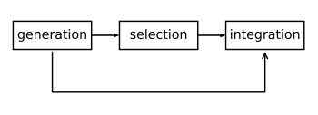
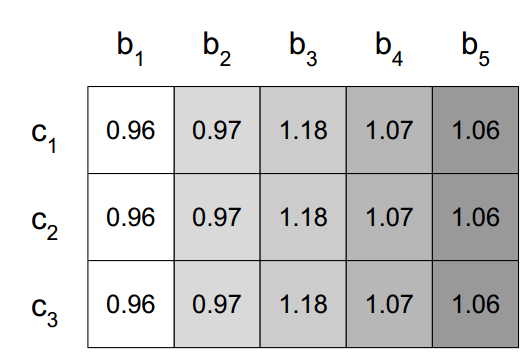

# EEL: An **E**stimation of Distribution Algorithm for **E**nsemble **L**earning

As the name says, EEL is an Estimation of Distribution Algorithm designed for ensemble learning. In order to understand how EEL functions, it is first necessary to explain how ensemble learning works.

## Introduction

Ensemble learning is comprised of three steps: generation, selection and integration. In the generation phase, an ensemble learning system is concerned with generating a diverse and accurate pool of base classifiers. In the selection step, base learners are selected from this pool and included in the proper ensemble. Finally, integration phase aims to adjust the voting weight of base learners in a way that the whole system becomes more accurate regarding its predictions. 



Figure 1: phases of the ensemble learning paradigm. While selection is optional, generation and integration are mandatory.

EEL actuates in the last step, integration. We start by running AdaBoost with decision trees as base classifiers for a given dataset. We then use the voting weights (one for each classifier) as starting point in a global search procedure conducted by an Estimation of Distribution Algorithm (EDA). However, we use one weight _per_ classifier _per_ class, as opposed to the AdaBoost strategy to using a _single_ weight _per_ classifier.



Figure 2: a typical individual within EEL. Each row is a class, and each column a classifier. This matrix of voting weights is optimized by an EDA.

## Publication

We have demonstrated in 

> Henry Cagnini, Márcio Basgalupp, Rodrigo Barros. Increasing Boosting Effectiveness with Estimation of Distribution Algorithms. IEEE Congress on Evolutionary Computation. Rio de Janeiro, Brazil, 2018.

that EEL fairly surpasses results from vanilla AdaBoost, as well as other two naïve implementations.

## Citation

If you find this repository useful to your work, please cite us by using the following bibtex entry:

```
@inproceedings{cagnini2018eel,
  title={Increasing Boosting Effectiveness with Estimation of Distribution Algorithms},
  author={Cagnini, Henry and Basgalupp, M\'{a}rcio and Barros, Rodrigo},
  booktitle={2018 IEEE Congress on Evolutionary Computation},
  year={2018},
  organization={IEEE}
}
```

## Testing
The experiments were conducted on a 10-fold cross-validation. We use a seed (defined in file ```params.json```) for partitioning the datasets into folds. By using ```random_state=0```, you will guarantee that the folds used by your algorithm are the same as the ones used by EEL.

We do not, however, set a seed for our stochastic algorithm to run, so expect slightly different results from EEL as the ones reported in the paper.

#### Setup

We provide a tutorial on how to run experiments based on the [Anaconda](https://www.anaconda.com/download/#linux) distribution of Python, with the Linux OS. Once installed, create a virtual environment for the experiments:

```
conda create --name env_eel python=2.7 --yes
```
Activate the environment using 
```
source activate env_eel
```
Install requirements from the file with
```
pip install -r requirements.txt
```
Finally, create a folder for meta data using 
```
mkdir metadata
```
You may have to create a specific folder for each tested algorithm.

For testing EEL, simply run a command like in the following example:
```
python test_eel.py "/home/user/datasets" "/home/user/metadata" "/home/user/params.json" "/home/user/results.csv" 10 4
``` 
with required parameters. 

Finally, The folder ```visual``` has several graphical ammenities used for generating figures in the paper. 